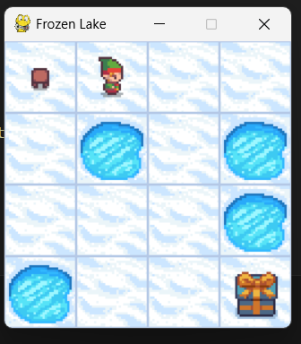
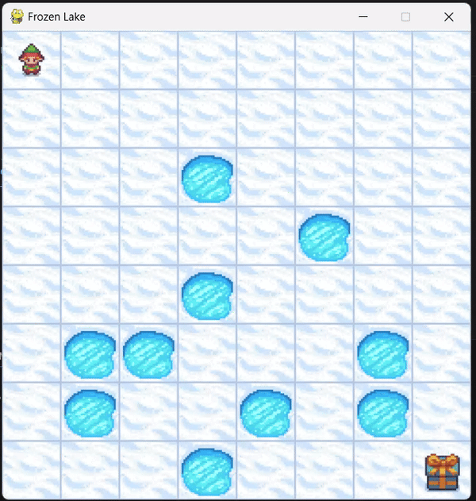
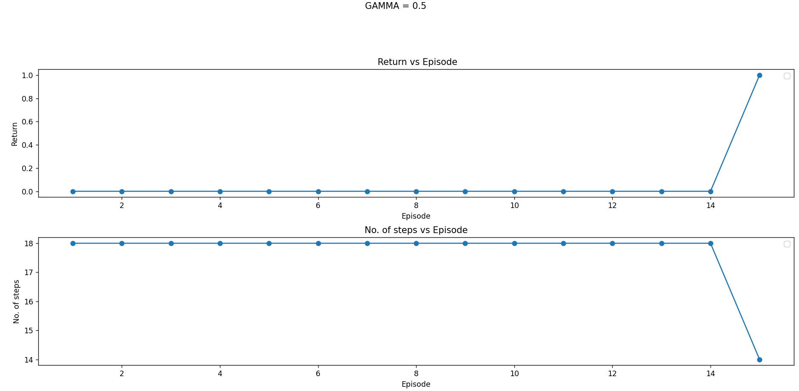
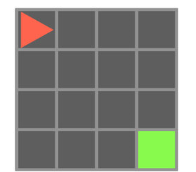
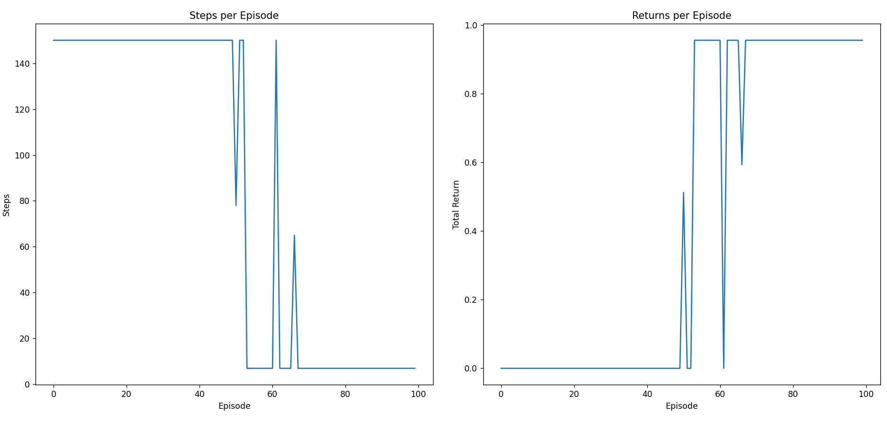
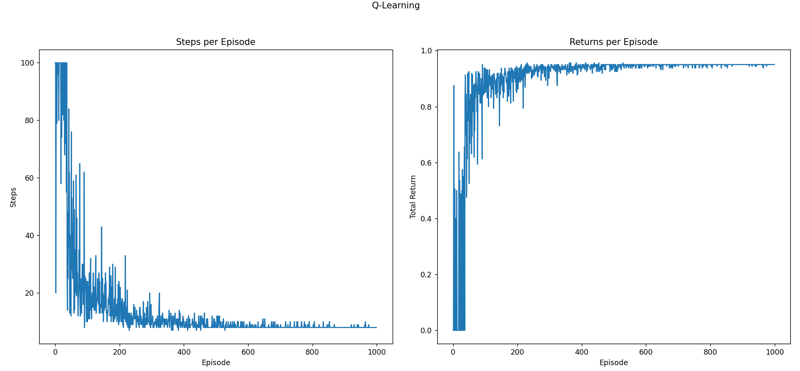
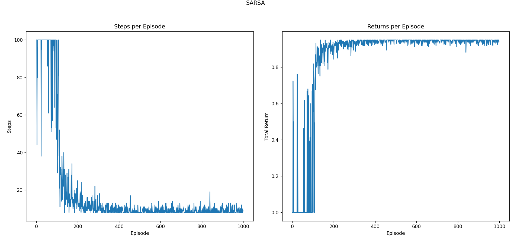
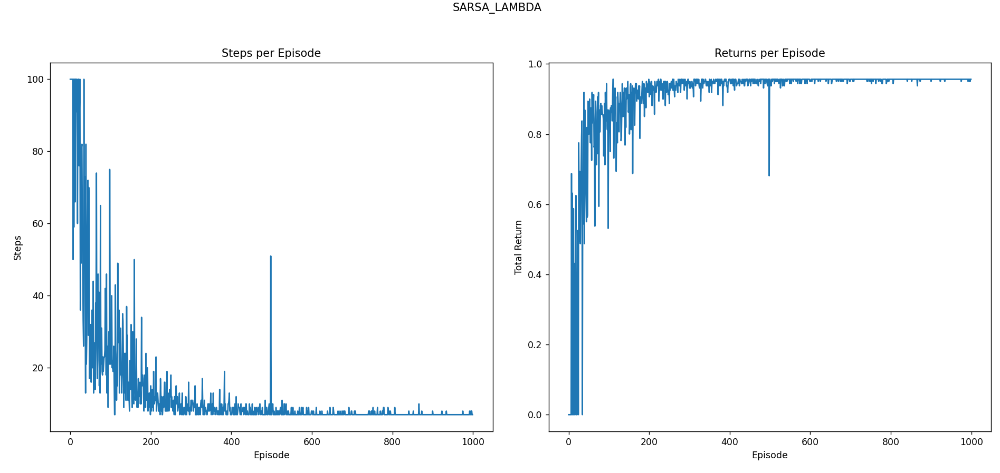

# Kuiper Belt Using Reinforcement Learning

## Aim
The objective of the project was to stimulate and analyse an agent's behaviour in the Kuiper belt environment and hence train it to maximise its reward in the environment using reinforcement learning.

## Libraries
1. Numpy
2. Matplotlib
3. Gymnasium
   - gym_minigrid
   - gym_kuiper_escape

#### Frozen lake environment
To grasp the basics, it was necessary to implement initial problems and algorithms of reinforcement learning on a simpler environment, and the Frozen Lake environment was the perfect choice. In this environment, there was complete knowledge of its dynamics, allowing the algorithms to be designed with these specifics in mind, resulting in the best possible solution.

###### State Space
Frozen lake involves crossing a frozen lake from Start to Goal without falling into any Holes by walking over the Frozen lake. The agent may not always move in the intended direction due to the slippery nature of the frozen lake.The observation is a value representing the agent’s current position as current_row * nrows + current_col.

###### Action Space
The agent takes a 1-element vector for actions. The action space is (dir), where dir decides direction to move in which can be:
   - 0: LEFT
   - 1: DOWN
   - 2: RIGHT
   - 3: UP

###### Reward Function
Reward schedule:
   - Reach goal: +1
   - Reach hole: 0
   - Reach frozen: 0

###### Algorithms
In the Frozen Lake environment, Dynamic Programming (DP) techniques are employed to derive an optimal policy for navigating through the grid. Specifically, the algorithms used include Policy Iteration and Value Iteration, both of which leverage the principles of dynamic programming to solve Markov Decision Processes (MDPs).

The link for the code has been provided below .

[Frozen Lake](Codes/my_Frozen_Lake.py)

Here's a GIF demonstrating the Frozen Lake algorithm:

###### Results

#### Minigrid Environment
After mastering the fundamentals in the Frozen Lake environment, our primary focus shifted to model-free environments, where the true implementation of reinforcement learning occurs. The MiniGrid environment provided an ideal platform for enhancing our understanding of model-free environments, particularly in training our agent in scenarios where the underlying dynamics are unknown.

###### State Space
The state space in MiniGrid is typically discrete, meaning that the agent perceives the environment as a finite set of states, each representing a specific configuration. The state representation generally includes:

   - Agent's Position: The current coordinates of the agent within the grid.
   - Agent's Orientation: The direction the agent is facing (e.g., north, south, east, west).

###### Action Space
The action space can be represented as a simple enumeration of discrete actions:

   - 0: Move Forward
   - 1: Turn Left
   - 2: Turn Right
   - 3: Pick Up
   - 4: Drop
   - 5: Toggle
   - 6: Done

###### Reward
Agents receive a positive reward for successfully reaching the goal.

###### Algorithms
Here's a brief overview of the algorithms used in the MiniGrid environment:

Algorithms Overview
1. *Monte Carlo Learning*:
Monte Carlo methods learn from episodes of experience. The agent observes the outcomes of its actions and updates its value estimates based on the average returns from those actions. It’s useful in environments with unknown dynamics and can handle stochasticity.

2. *Q-Learning*:
Q-Learning is an off-policy algorithm that aims to learn the optimal action-value function.This allows the agent to learn the best action to take in a given state, even when it explores the environment.

3. *SARSA* (State-Action-Reward-State-Action):
SARSA is an on-policy algorithm that updates Q-values based on the action actually taken by the agent .This means the agent learns the value of the policy it follows, which can lead to more stable learning in certain environments.

4. *SARSA(λ)*:
SARSA(λ) combines the concepts of SARSA with eligibility traces, allowing the agent to update not just the most recent state-action pair but also previous pairs based on their eligibility. This can speed up learning and improve convergence by effectively blending Monte Carlo and temporal-difference methods.

These algorithms provide various approaches to learning optimal policies in the MiniGrid environment, accommodating different strategies and learning paradigms.The codes for each of these algrorithms have been attached below.

[Monte Carlo](https://github.com/AarushSinha07/Kuiper_Belt/blob/main/Codes/Minigrid/MCminigrid.py)

[Q Learning](https://github.com/AarushSinha07/Kuiper_Belt/blob/main/Codes/Minigrid/QlearnMini.py)

[Sarsa](https://github.com/AarushSinha07/Kuiper_Belt/blob/main/Codes/Minigrid/sarsa.py)

[Sarsa(λ)](https://github.com/AarushSinha07/Kuiper_Belt/blob/main/Codes/Minigrid/sarsalambda.py)

###### Results 

